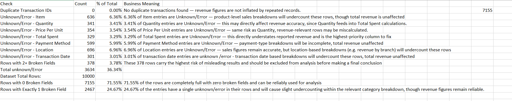
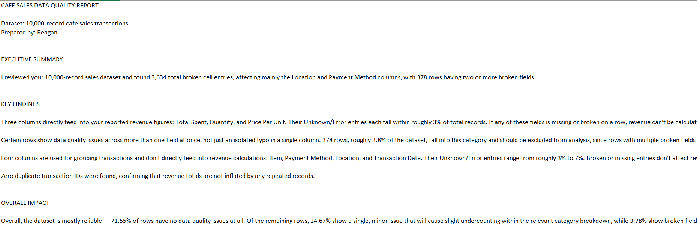

# Cafe Sales Data Quality Audit

Excel-based data quality audit and client-facing report on a 10,000-row Kaggle 
cafe sales dataset — from raw diagnostic formulas to a polished report a 
non-technical client could act on directly.

## Overview
Starting from a deliberately "dirty" Kaggle dataset, this project builds a 
three-sheet diagnostic system to quantify exactly how messy the data is, then 
translates the findings into a prioritized, client-ready report.

## Dataset
Kaggle "dirty" cafe sales dataset — 10,000 transactions with intentionally 
introduced data quality issues (missing values, "Unknown"/"Error" entries) 
across Item, Quantity, Price Per Unit, Total Spent, Payment Method, Location, 
and Transaction Date.

## Tools Used
Microsoft Excel — Tables, COUNTIF, SUMPRODUCT, COUNTA formulas.

## Process
1. Loaded raw data into a structured Excel Table for safe, name-based referencing
2. Built 12 automated diagnostic checks: duplicate detection, per-column 
   Unknown/Error counts across all 7 columns, and a multi-field broken-row 
   breakdown (0 / 1 / 2+ broken fields per row)
3. Cross-verified formulas independently (confirmed the 0/1/2+ tiers summed 
   correctly to 10,000 rows)
4. Logged findings and translated results into a client-facing report with 
   prioritized, actionable recommendations

## Screenshots

## Key Findings
- 71.55% of rows are fully clean; 24.67% have one minor issue; 3.78% (378 rows) 
  are high-risk with 2+ broken fields and should be excluded from analysis
- Zero duplicate transaction IDs — revenue totals are not inflated
- Total Spent, Quantity, and Price Per Unit (the revenue-relevant columns) each 
  have roughly 3% Unknown/Error entries

## Author
Reagan — Civil Engineering student, JKUAT, building a data analytics portfolio