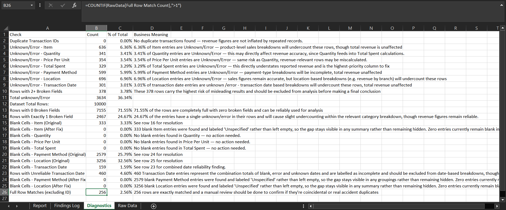
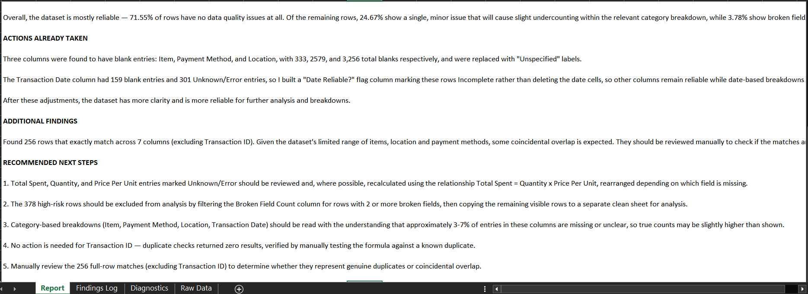

# Cafe Sales Data Quality Audit

Excel-based data quality audit and client-facing report on a 10,000-row Kaggle 
cafe sales dataset — from raw diagnostic formulas to a polished report a 
non-technical client could act on directly.

## Overview
Starting from a deliberately "dirty" Kaggle dataset, this project builds a 
three-sheet diagnostic system to quantify exactly how messy the data is, then 
translates the findings into a prioritized, client-ready report.

## Dataset
Kaggle "dirty" cafe sales dataset — 10,000 transactions with intentionally 
introduced data quality issues (missing values, "Unknown"/"Error" entries) 
across Item, Quantity, Price Per Unit, Total Spent, Payment Method, Location, 
and Transaction Date.

## Tools Used
Microsoft Excel — Tables, COUNTIF, SUMPRODUCT, COUNTA formulas.

## Process
 Process
1. Loaded raw data into a structured Excel Table for safe, name-based referencing
2. Built a Diagnostics sheet with automated checks: duplicate IDs, per-column 
   Unknown/Error counts, and a per-row Broken Field Count (0 / 1 / 2+ broken fields)
3. Handled missing data: filled categorical blanks (Item, Payment Method, Location) 
   with "Unspecified" labels; flagged unreliable Transaction Date entries instead 
   of guessing values
4. Standardized text consistency (capitalization, spacing) across Location and 
   Payment Method using PROPER/TRIM, with before/after verification
5. Built a 7-condition COUNTIFS check to detect full-row duplicates (excluding 
   Transaction ID) for manual review
6. Discovered and fixed a dataset-wide issue: Transaction Date was stored as text, 
   not real dates — converted using VALUE(), preserving readable labels for 
   unrecoverable entries
7. Added Data Validation dropdowns to prevent future inconsistent entries
8. Logged findings and translated results into a client-facing report with 
   prioritized, actionable recommendations
9. Audited the full workbook for consistency, catching and correcting a 
   pre-existing total error from the original report
## Screenshots

## Key Findings
Key Findings
- 70.38% of rows are fully clean; 25.47% have one minor issue; 4.15% (415 rows) 
  are high-risk with 2+ broken fields and should be excluded from analysis
- 363 rows match exactly across all 7 non-ID columns — flagged for manual review 
  as possible duplicates or coincidental overlap
- Zero duplicate transaction IDs — revenue totals are not inflated
- Transaction Date entries were originally stored as text; all were converted to 
  real, sortable dates
## Author
Reagan — Civil Engineering student, JKUAT, building a data analytics portfolio